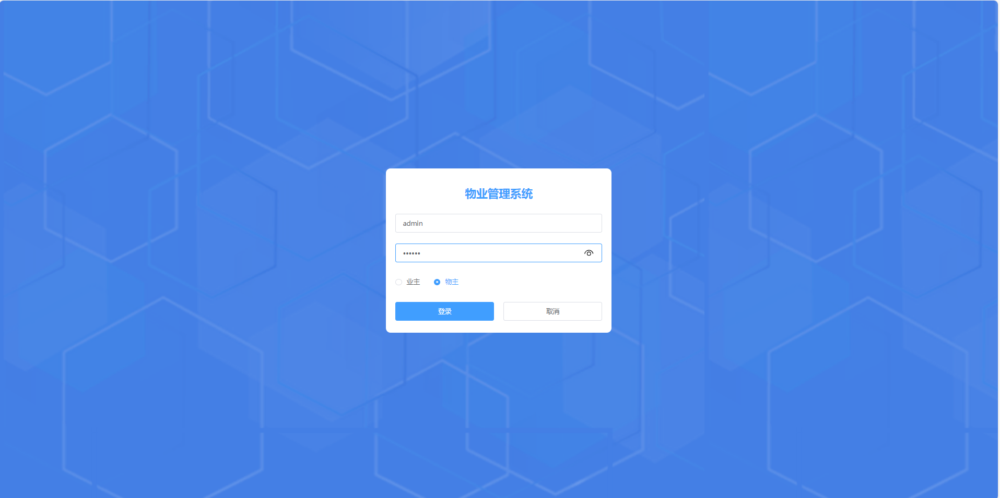
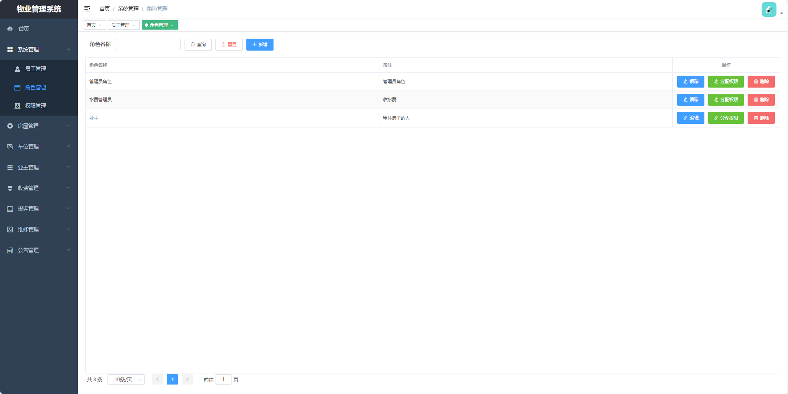
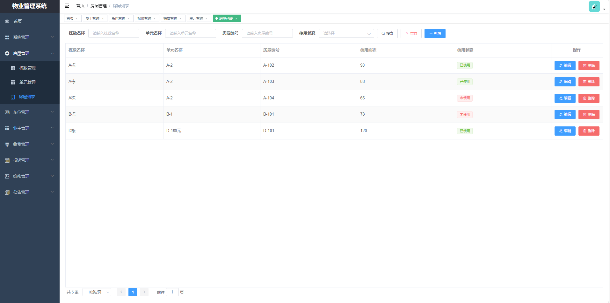
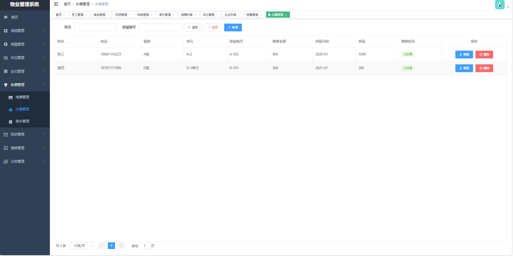
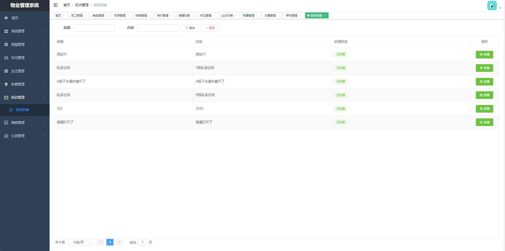
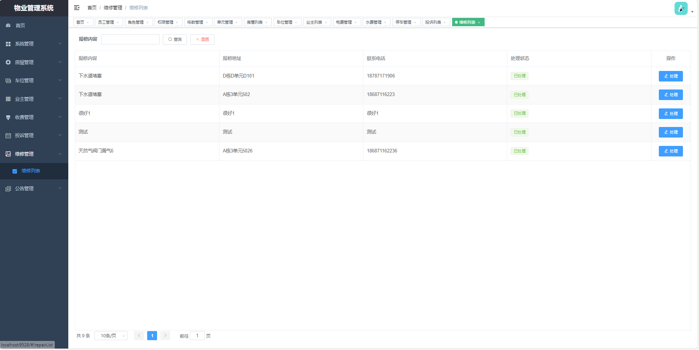

# 基于springboot+vue前后端分离的物业管理系统

### 9.9￥ 获取完整源码+sql，需要加Q：3808981644  或者加微信 ：qszard26
### 有问题，或者需要协助调试运行项目的也可联系
### 获取更多项目，关注公众号：编程项目集

### 另外两个物业管理系统

https://github.com/34426/property-management-system

https://github.com/34426/wuyemanagement

## 一、项目介绍

开发语言：java

运行环境:idea或eclipse vscode 数据库:mysql

后端技术：SpringBoot、Mybatisplus

前端技术：Vue、ElementUI

系统设计两个角色：物业、业主

物业：首页、员工管理、角色管理、权限管理、栋数管理、单元管理、房屋列表、车位管理、业主管理、电费管理、水费管理、停车管理、投诉管理、维修管理、公告管理

业主：首页、投诉管理、缴费管理（我的电费、我的水费、我的停车费）、维修管理、公告管理

## 二、部分功能界面展示

### 9.9￥ 获取完整源码+sql，需要加Q：3808981644  或者加微信 ：qszard26
### 有问题，或者需要协助调试运行项目的也可联系

